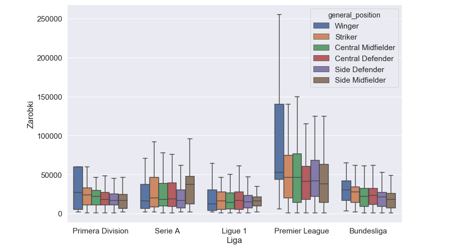
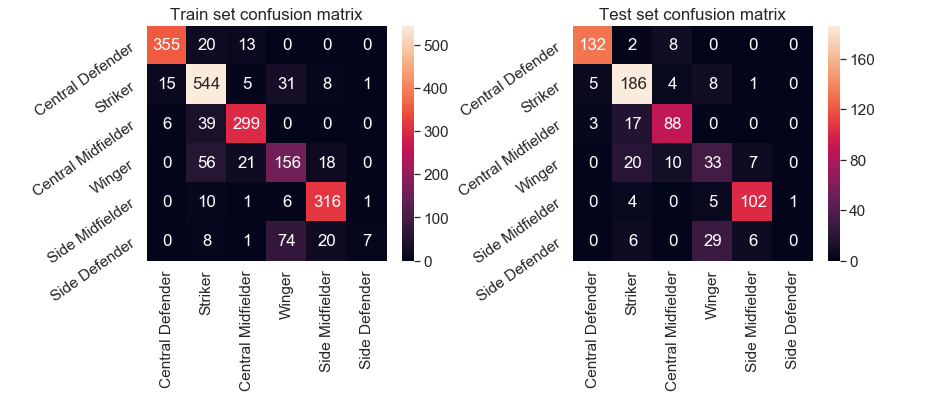

# Wages analysis and football players classification

In the 21st century, football is by far the most popular sport in the world, and the countless leagues in most officially recognised countries allow even the most eccentric tastes to be satisfied. At present, according to the FIFA ranking, there are five leagues among the most popular and best:

- **Premier League** - the best league in England,
- **Primera Division** - the best league in Spain,
- **Bundesliga** - the best league in Germany,
- **Serie A** - the best league in Italy,
- **Ligue 1** - the best league in France.

Due to the popularity of this discipline, it is also very well paid. Players in the English Premier League earn on average, which is the highest score among the listed league games. This survey will determine what are the dominant earnings drivers in each league (**Multiple Regression**) and whether we are able to determine their overall position on the pitch (**KNN**, **Random Forest**, **AdaBoosting**) based on player statistics. Due to the differences in statistics that characterise the players, only field players have been taken into account in the survey. **It should be taken into account that the data from Fifa are not fully representative**

 

## Data

Most of the data were downloaded from https://www.kaggle.com/stefanoleone992/fifa-20-complete-player-dataset and relate to the 2019/2020 season. They concern the statistics that footballers have in the latest version of the cult series which is FIFA.

## Files

The analysis file is made in Polish, but the comments in the code files are in English.

- **Data directory** - you can find there a csv file with the players data
- **HTML directory** - knitted file with "ipynb" extension, you can find there results and analysis (polish language)
- **Images directory** - you can find there plots included in README
- **Wages_analysis_and_classification.ipynb** - project file (jupiter extension)
- **Wages_analysis_and_classification.py** - project file

## Main libraries

- **sklearn**, **statsmodels** - Machine Learning

- **matplotlib.pyplot**, **seaborn**- Visualization

- **pandas**, **numpy**- Generally useful libraries

## Contributors

- **Mateusz Jałocha** (mat.jalocha@gmail.com, https://www.linkedin.com/in/mateusz-jałocha-8942701b6/)
