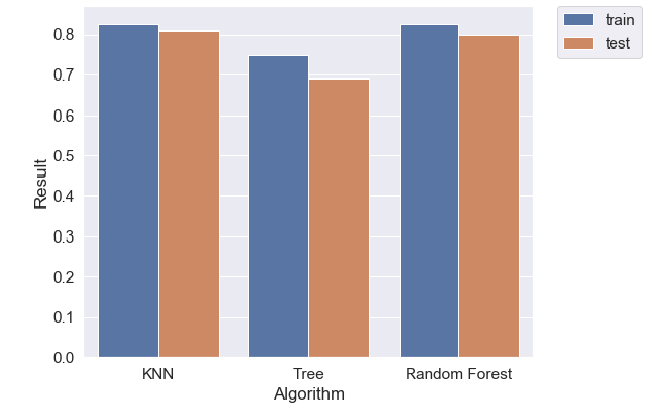

# Wages analysis and football players classification

In the 21st century, football is by far the most popular sport in the world, and the countless leagues in most officially recognised countries allow even the most eccentric tastes to be satisfied. At present, according to the FIFA ranking, there are five leagues among the most popular and best:

- **Premier League** - the best league in England,
- **Primera Division** - the best league in Spain,
- **Bundesliga** - the best league in Germany,
- **Serie A** - the best league in Italy,
- **Ligue 1** - the best league in France.

Due to the popularity of this discipline, it is also very well paid. Players in the English Premier League earn on average £3m a year, which is the highest score among the listed leagues. This survey will determine what are the dominants of earnings players in each league (**Multiple Regression**) and whether we are able to determine their main position on the pitch (**KNN**, **Random Forest**, **AdaBoosting**) based on player statistics. Due to the differences in statistics that characterise the players, only field players have been taken into account in the survey. Below is a boxplot with players earnings depending on the league and position on the pitch and confusion matrix. **It should be taken into account that the data from Fifa are not fully representative**.

 

## Data

Most of the data were downloaded from https://www.kaggle.com/stefanoleone992/fifa-20-complete-player-dataset and relate to the 2019/2020 season. They contain statistics on FIFA 2020 players.

## Conclusions

The study analyzed the salaries of players depending on their position and the league in which their club plays. In addition, the wage determinants were verified with the division into leagues, where it turned out that:

- **Premier League** - determinants were: player value (**0.0028**), age (**3 243**), potential (**1 047**), ability to perform tricks (**3 130**), is he a winger (**4681**),
- **Bundesliga** - determinants are: player value (**0.0025**), defense skills (**176**), attacking volleys (**247**), is he a winger (**5 381**),
- **Primera Division** - determinants are: player value (**0.0041**), age (**888**), is he a winger (**18 270**),
- **Series A** - determinants are: player value (**0.0026**), age (**2 065**), potential (**549**), speed (**115**),
- **Ligue 1** - determinants are: player value (**0.0021**), the overall score (**933**), the ability to keep a cool head when performing punishment (84), whether he is a sidekick (**-4 483**) or a winger (**1 712**).

The values in parentheses indicate how much earnings (€) will increase when the variable is increased by one unit. In all leagues, the value of a footballer significantly influences earnings, and whether a footballer is a winger only in the A Series is not important. Recently, there has been a significant increase in the value of transfers of young talented footballers in the football world. Although their value is high, clubs often do not decide on a payroll disorder, which can be reflected in the fact that age has a significant positive impact on the earnings of players.

In the second part, classification models were created (**KNN**, **Deciding Tree**, **Random Forest**), by means of which players were assigned to a position (middle defender, side defender, midfielder, side midfielder, striker, winger). A summary of the results is presented in the bar chart below.

## Files

The analysis file is made in Polish, but comments in the files with code are in English.

- **Data directory** - you can find there a csv file with the players data
- **HTML directory** - knitted file with "ipynb" extension, you can find there results and analysis (polish language)
- **Images directory** - you can find there plots included in README
- **Wages_analysis_and_classification.ipynb** - project file (jupiter extension)
- **Wages_analysis_and_classification.py** - project file

## Main libraries

- **sklearn**, **statsmodels** - Machine Learning

- **matplotlib.pyplot**, **seaborn**- Visualization

- **pandas**, **numpy**- Generally useful libraries

## Contributors

- **Mateusz Jałocha** (mat.jalocha@gmail.com, https://www.linkedin.com/in/mateusz-jałocha)
